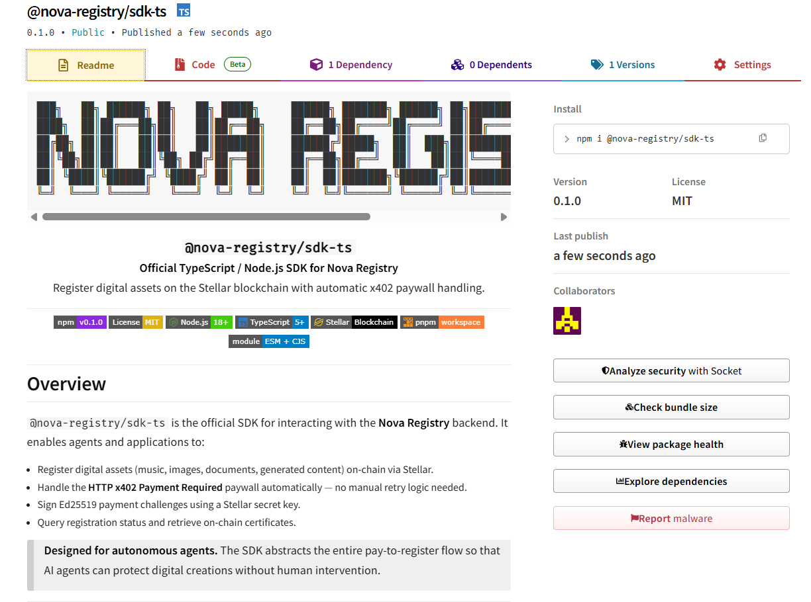

<div align="center">

```
███╗   ██╗ ██████╗ ██╗   ██╗ █████╗     ██████╗ ███████╗ ██████╗ ██╗███████╗████████╗██████╗ ██╗   ██╗
████╗  ██║██╔═══██╗██║   ██║██╔══██╗    ██╔══██╗██╔════╝██╔════╝ ██║██╔════╝╚══██╔══╝██╔══██╗╚██╗ ██╔╝
██╔██╗ ██║██║   ██║██║   ██║███████║    ██████╔╝█████╗  ██║  ███╗██║███████╗   ██║   ██████╔╝ ╚████╔╝ 
██║╚██╗██║██║   ██║╚██╗ ██╔╝██╔══██║    ██╔══██╗██╔══╝  ██║   ██║██║╚════██║   ██║   ██╔══██╗  ╚██╔╝  
██║ ╚████║╚██████╔╝ ╚████╔╝ ██║  ██║    ██║  ██║███████╗╚██████╔╝██║███████║   ██║   ██║  ██║   ██║   
╚═╝  ╚═══╝ ╚═════╝   ╚═══╝  ╚═╝  ╚═╝    ╚═╝  ╚═╝╚══════╝ ╚═════╝ ╚═╝╚══════╝   ╚═╝   ╚═╝  ╚═╝   ╚═╝  
```

### `@nova-registry/sdk-ts`

**Official TypeScript / Node.js SDK for Nova Registry**  
Register digital assets on the Stellar blockchain with automatic x402 paywall handling.

---

[](https://www.npmjs.com/package/@nova-registry/sdk-ts)
[](https://www.npmjs.com/package/@nova-registry/sdk-ts)
[](https://bundlephobia.com/package/@nova-registry/sdk-ts)
[](https://opensource.org/licenses/MIT)
[](https://nodejs.org)
[](https://www.typescriptlang.org)
[](https://stellar.org)
[]()

> **[View on npm →](https://www.npmjs.com/package/@nova-registry/sdk-ts)**

---

<a href="https://www.npmjs.com/package/@nova-registry/sdk-ts" target="_blank">
  
</a>

---

### Try it now — one command away

```bash
npm i @nova-registry/sdk-ts
```

The SDK is **live, public, and ready to use**. No setup beyond a Stellar secret key and a Nova Registry backend URL. Register your first digital asset in minutes.

</div>

---

## Overview

`@nova-registry/sdk-ts` is the official SDK for interacting with the **Nova Registry** backend. It enables agents and applications to:

- Register digital assets (music, images, documents, generated content) on-chain via Stellar.
- Handle the **HTTP x402 Payment Required** paywall automatically — no manual retry logic needed.
- Sign Ed25519 payment challenges using a Stellar secret key.
- Query registration status and retrieve on-chain certificates.

> **Designed for autonomous agents.** The SDK abstracts the entire pay-to-register flow so that AI agents can protect digital creations without human intervention.

---

## Table of Contents

1. [Architecture Overview](#1-architecture-overview)
2. [Requirements](#2-requirements)
3. [Installation](#3-installation)
4. [Quick Start](#4-quick-start)
5. [x402 Payment Flow — In Depth](#5-x402-payment-flow--in-depth)
6. [API Reference](#6-api-reference)
   - [Constructor](#constructor)
   - [registerAsset](#registerasset)
   - [getRegistrationStatus](#getregistrationstatus)
   - [getCertificate](#getcertificate)
   - [getCertificateByHash](#getcertificatebyhash)
7. [Types & Data Contracts](#7-types--data-contracts)
8. [Error Handling](#8-error-handling)
9. [Security Best Practices](#9-security-best-practices)
10. [Backend Integration Guide](#10-backend-integration-guide)
11. [Build & Publishing](#11-build--publishing)
12. [FAQ](#12-faq)
13. [License](#13-license)

---

## 1. Architecture Overview

```
┌─────────────────────────────────────────────────────────────────┐
│                          Your Agent / App                       │
│                                                                 │
│   sdk.registerAsset({ contentHash, title, ... })                │
└───────────────────────────┬─────────────────────────────────────┘
                            │ POST /v1/register
                            ▼
┌─────────────────────────────────────────────────────────────────┐
│                      Nova Registry Backend                      │
│                                                                 │
│   If free tier / already paid  ──►  202 Accepted  ──►  done    │
│                                                                 │
│   If payment required          ──►  402 Payment Required        │
│     { amount, asset, nonce, expiresAt, resource, ... }          │
└───────────────────────────┬─────────────────────────────────────┘
                            │ 402
                            ▼
┌─────────────────────────────────────────────────────────────────┐
│                        SDK — Auto-Pay Flow                      │
│                                                                 │
│  1. Generate UUID idempotency key                               │
│  2. Build canonical JSON challenge (sorted keys)                │
│  3. Sign challenge with Ed25519 (Stellar Keypair)               │
│  4. Retry POST /v1/register + payment headers                   │
│       payment-signature   x-stellar-public-key                  │
│       x-payment-nonce     x-idempotency-key                     │
│       x-stellar-network                                         │
└───────────────────────────┬─────────────────────────────────────┘
                            │ POST /v1/register (with payment)
                            ▼
┌─────────────────────────────────────────────────────────────────┐
│                      Nova Registry Backend                      │
│                                                                 │
│   Validate signature + nonce + idempotency                      │
│   Enqueue / confirm on-chain registration                       │
│                                                                 │
│   202 Accepted  ──►  { requestId, status: "queued" }           │
└─────────────────────────────────────────────────────────────────┘
```

---

## 2. Requirements

| Requirement | Version / Details |
|---|---|
| Node.js | 18+ (20+ recommended) |
| Stellar Secret Key | Valid `S...` format key |
| Nova Registry URL | Backend API endpoint |
| Backend compatibility | Must implement x402 contract (see [§10](#10-backend-integration-guide)) |

---

## 3. Installation

The package is published and available on npm:

**[https://www.npmjs.com/package/@nova-registry/sdk-ts](https://www.npmjs.com/package/@nova-registry/sdk-ts)**

<details open>
<summary><strong>npm</strong></summary>

```bash
npm i @nova-registry/sdk-ts
```

</details>

<details>
<summary><strong>pnpm</strong></summary>

```bash
pnpm add @nova-registry/sdk-ts
```

</details>

<details>
<summary><strong>yarn</strong></summary>

```bash
yarn add @nova-registry/sdk-ts
```

</details>

---

## 4. Quick Start

```ts
import { NovaRegistrySDK } from "@nova-registry/sdk-ts";
import crypto from "node:crypto";

// 1. Initialize the SDK with your Stellar secret key
const sdk = new NovaRegistrySDK({
  stellarSecret: process.env.AGENT_STELLAR_SECRET!, // never hardcode this
  registryUrl: "https://api.novaregistry.com",
  network: "testnet",
  timeoutMs: 20_000,
});

async function protectAISong() {
  // 2. Hash the content you want to register
  const audioBuffer = Buffer.from("...binary_audio_data...");
  const contentHash = `sha256:${crypto.createHash("sha256").update(audioBuffer).digest("hex")}`;

  // 3. Register the asset — the SDK handles x402 automatically
  const receipt = await sdk.registerAsset({
    contentHash,
    fileName: "cybernetic-lullaby.wav",
    title: "Cybernetic Lullaby",
    artist: "Nova Agent",
    metadata: {
      genre: "synthwave",
      aiModel: "Claude 3.5 Sonnet / Audio Gen v2",
    },
  });

  console.log("Registration accepted:", receipt.requestId);
  console.log("Status:", receipt.status); // "queued" | "processing" | "confirmed"

  // 4. Poll or check status later
  const status = await sdk.getRegistrationStatus(receipt.requestId);
  console.log("On-chain status:", status.status);
  console.log("Certificate ID:", status.certificateId);
  console.log("TX Hash:", status.txHash);

  // 5. Retrieve the certificate once confirmed
  if (status.certificateId) {
    const cert = await sdk.getCertificate(status.certificateId);
    console.log("Certificate:", cert);
    console.log("Explorer:", cert.explorerUrl);
  }
}

protectAISong().catch(console.error);
```

---

## 5. x402 Payment Flow — In Depth

The SDK implements the full **HTTP x402 Payment Required** protocol automatically when `registerAsset` is called.

```
Client                         Nova Registry Backend
  │                                     │
  │── POST /v1/register ───────────────►│
  │   { contentHash, title, ... }       │
  │                                     │
  │◄── 402 Payment Required ────────────│
  │   {                                 │
  │     error: "payment_required",      │
  │     payment: {                      │
  │       amount, asset, network,       │
  │       resource, nonce, expiresAt    │
  │     }                               │
  │   }                                 │
  │                                     │
  │  [SDK auto-pay logic]               │
  │  1. Generate idempotency UUID       │
  │  2. Build canonical challenge:      │
  │     JSON.stringify({                │
  │       amount, asset, expiresAt,     │
  │       idempotencyKey, network,      │
  │       nonce, payerAddress,          │
  │       resource, contentHash         │ ← sorted keys
  │     })                              │
  │  3. Sign with Ed25519 (Stellar)     │
  │  4. Base64-encode signature         │
  │                                     │
  │── POST /v1/register ───────────────►│
  │   { contentHash, title, ... }       │
  │   + Headers:                        │
  │     payment-signature: <base64>     │
  │     x-stellar-public-key: <pubkey>  │
  │     x-payment-nonce: <nonce>        │
  │     x-idempotency-key: <uuid>       │
  │     x-stellar-network: testnet      │
  │                                     │
  │◄── 202 Accepted ────────────────────│
  │   { requestId, status: "queued" }   │
```

### Canonical Challenge Format

The signed string is a **deterministic JSON** with keys in **alphabetical order** (no whitespace):

```json
{
  "amount": "1.0000000",
  "asset": "XLM",
  "contentHash": "sha256:abc123...",
  "expiresAt": "2026-04-13T12:00:00Z",
  "idempotencyKey": "550e8400-e29b-41d4-a716-446655440000",
  "network": "testnet",
  "nonce": "unique-server-nonce",
  "payerAddress": "GABC...XYZ",
  "resource": "/v1/register"
}
```

> **Critical:** The backend must produce the exact same canonical JSON when verifying. Any ordering or whitespace difference will cause signature mismatch.

---

## 6. API Reference

### Constructor

```ts
new NovaRegistrySDK(config: NovaRegistrySDKConfig)
```

| Parameter | Type | Required | Default | Description |
|---|---|---|---|---|
| `stellarSecret` | `string` | ✅ | — | Stellar secret key (`S...` format) |
| `registryUrl` | `string` | ✅ | — | Nova Registry backend base URL |
| `network` | `"testnet" \| "mainnet"` | ❌ | `"testnet"` | Stellar network to use |
| `timeoutMs` | `number` | ❌ | `20000` | HTTP request timeout in milliseconds |

**Public property:**

```ts
sdk.payerAddress: string
// Returns the Stellar public key derived from stellarSecret
```

---

### `registerAsset`

```ts
registerAsset(input: RegisterAssetInput): Promise<RegisterAcceptedResponse>
```

Registers a digital asset. Automatically handles the x402 payment flow if the backend requires payment.

| Field | Type | Required | Description |
|---|---|---|---|
| `contentHash` | `string` | ✅ | Content hash, e.g. `sha256:abc...` |
| `fileName` | `string` | ❌ | Original file name |
| `title` | `string` | ❌ | Human-readable title |
| `artist` | `string` | ❌ | Creator / artist name |
| `ownerAddress` | `string` | ❌ | Stellar address of the rights owner. Defaults to `payerAddress` |
| `metadata` | `Record<string, unknown>` | ❌ | Arbitrary key/value metadata |

**Returns:** [`RegisterAcceptedResponse`](#registeracceptedresponse)

**Throws:** [`NovaRegistryError`](#novaregistryerror) on HTTP errors after payment attempt.

---

### `getRegistrationStatus`

```ts
getRegistrationStatus(requestId: string): Promise<RegisterStatusResponse>
```

Queries the current processing status of a registration request.

| Status | Description |
|---|---|
| `queued` | Accepted, waiting to be processed |
| `processing` | On-chain transaction being submitted |
| `confirmed` | Successfully registered on Stellar |
| `failed` | Registration failed (see `txHash` for details) |

**Returns:** [`RegisterStatusResponse`](#registerstatusresponse)

---

### `getCertificate`

```ts
getCertificate(certificateId: string): Promise<CertificateResponse>
```

Retrieves the final on-chain certificate for a registered asset by its certificate ID.

**Returns:** [`CertificateResponse`](#certificateresponse)

---

### `getCertificateByHash`

```ts
getCertificateByHash(contentHash: string): Promise<{
  exists: boolean;
  certificateId?: string;
  txHash?: string;
}>
```

Checks whether a content hash has already been registered. Useful to avoid duplicate registrations.

| Field | Description |
|---|---|
| `exists` | `true` if a certificate exists for this hash |
| `certificateId` | Certificate ID if it exists |
| `txHash` | Stellar transaction hash if it exists |

---

## 7. Types & Data Contracts

### `NovaRegistrySDKConfig`

```ts
interface NovaRegistrySDKConfig {
  stellarSecret: string;
  registryUrl: string;
  network?: "testnet" | "mainnet";
  timeoutMs?: number;
}
```

### `RegisterAssetInput`

```ts
interface RegisterAssetInput {
  contentHash: string;
  fileName?: string;
  title?: string;
  artist?: string;
  ownerAddress?: string;
  metadata?: Record<string, unknown>;
}
```

### `PaymentRequiredResponse`

Returned by the backend when HTTP 402 is triggered:

```ts
interface PaymentRequiredResponse {
  error: "payment_required";
  message: string;
  payment: {
    amount: string;       // e.g. "1.0000000"
    asset: string;        // e.g. "XLM"
    network: string;      // e.g. "testnet"
    resource: string;     // e.g. "/v1/register"
    nonce: string;        // unique server-generated nonce
    expiresAt: string;    // ISO 8601 timestamp
    facilitator?: string;
    requiredHeaders?: string[];
  };
}
```

### `RegisterAcceptedResponse`

```ts
interface RegisterAcceptedResponse {
  requestId: string;
  status: "queued" | "processing" | "confirmed" | "failed";
  paymentStatus?: "confirmed" | "failed" | "pending";
  message?: string;
}
```

### `RegisterStatusResponse`

```ts
interface RegisterStatusResponse {
  requestId: string;
  status: "queued" | "processing" | "confirmed" | "failed";
  paymentStatus?: "confirmed" | "failed" | "pending";
  certificateId: string | null;
  txHash: string | null;
  explorerUrl: string | null;
  createdAt?: string;
}
```

### `CertificateResponse`

```ts
interface CertificateResponse {
  certificateId: string;
  title?: string;
  artist?: string;
  contentHash: string;
  ownerAddress: string;
  network: string;
  contractId?: string;
  txHash: string;
  explorerUrl: string;
  registeredAt: string;        // ISO 8601
  metadata?: Record<string, unknown>;
}
```

### `NovaRegistryError`

```ts
class NovaRegistryError extends Error {
  name: "NovaRegistryError";
  status: number;      // HTTP status code
  details?: unknown;   // Raw backend response body
}
```

---

## 8. Error Handling

The SDK throws `NovaRegistryError` for all HTTP-level failures from the backend, and standard `Error` for network/timeout issues.

```ts
import { NovaRegistrySDK, NovaRegistryError } from "@nova-registry/sdk-ts";

try {
  const receipt = await sdk.registerAsset({ contentHash: "sha256:abc123..." });
} catch (error) {
  if (error instanceof NovaRegistryError) {
    // Backend returned a non-2xx response
    console.error("HTTP status:", error.status);
    console.error("Backend details:", error.details);

    if (error.status === 401) console.error("Invalid or expired signature");
    if (error.status === 409) console.error("Duplicate registration detected");
    if (error.status === 500) console.error("Backend error, retry later");
  } else {
    // Network failure, DNS error, timeout, etc.
    console.error("Network or runtime error:", error.message);
  }
}
```

### Common Error Scenarios

| Scenario | Error Type | `status` | Notes |
|---|---|---|---|
| Request timeout | `Error` | — | Message: `"Request timed out while contacting Nova Registry API"` |
| Invalid 402 payload | `NovaRegistryError` | 400 | Backend returned malformed payment instructions |
| Signature mismatch | `NovaRegistryError` | 401 | Challenge canonical mismatch between SDK and backend |
| Duplicate registration | `NovaRegistryError` | 409 | Hash already has a certificate |
| Backend unreachable | `Error` | — | DNS / TCP failure |

---

## 9. Security Best Practices

> Your Stellar secret key controls your funds and identity. Treat it with the same care as a private key in any blockchain system.

- **Never hardcode** `stellarSecret` in source code or config files committed to git.
- **Use environment variables** or a secrets vault (e.g. AWS Secrets Manager, HashiCorp Vault, Doppler).
- **Rotate keys** periodically in production environments.
- **Use testnet** for all development and integration testing.
- **Set a realistic `timeoutMs`** based on your actual infrastructure latency.
- **Never log** the `payment-signature` header or raw key material.
- **Separate owner from payer** — use `ownerAddress` to represent the rights owner if different from the signing account.

```ts
// ✅ Good — load from environment
const sdk = new NovaRegistrySDK({
  stellarSecret: process.env.AGENT_STELLAR_SECRET!,
  registryUrl: process.env.NOVA_REGISTRY_URL!,
});

// ❌ Bad — hardcoded secret
const sdk = new NovaRegistrySDK({
  stellarSecret: "SCZANGBA5IPES62K3LQKLEDKP65MPNCCDRZZLQ3S...",
});
```

---

## 10. Backend Integration Guide

For the SDK to work correctly, the Nova Registry backend must implement the following contract:

### Step 1 — Initial Request (no payment)

The backend **must** return a `402 Payment Required` response with this exact structure when payment is needed:

```json
HTTP/1.1 402 Payment Required
Content-Type: application/json

{
  "error": "payment_required",
  "message": "Payment required to register this asset",
  "payment": {
    "amount": "1.0000000",
    "asset": "XLM",
    "network": "testnet",
    "resource": "/v1/register",
    "nonce": "<unique-server-nonce>",
    "expiresAt": "2026-04-13T13:00:00Z"
  }
}
```

### Step 2 — Signed Request Validation

The backend must validate all of the following headers in the second request:

| Header | Description |
|---|---|
| `payment-signature` | Base64-encoded Ed25519 signature of the canonical challenge |
| `x-stellar-public-key` | Signer's Stellar public key |
| `x-payment-nonce` | Must match the `nonce` from the 402 response |
| `x-idempotency-key` | UUID — used for replay protection |
| `x-stellar-network` | `testnet` or `mainnet` |

### Step 3 — Canonical Challenge Verification

Reconstruct the **exact same** canonical challenge and verify the signature:

```ts
// Backend verification logic (pseudocode)
const canonicalChallenge = JSON.stringify({
  amount: payment.amount,
  asset: payment.asset,
  contentHash: body.contentHash,
  expiresAt: payment.expiresAt,
  idempotencyKey: headers["x-idempotency-key"],
  network: payment.network,
  nonce: payment.nonce,
  payerAddress: headers["x-stellar-public-key"],
  resource: payment.resource,
});

const isValid = ed25519.verify(
  base64.decode(headers["payment-signature"]),
  Buffer.from(canonicalChallenge, "utf8"),
  stellarPublicKeyToBytes(headers["x-stellar-public-key"]),
);
```

> **Key ordering is alphabetical and must be exact.** Any deviation will cause signature verification to fail.

---

## 11. Build & Publishing

```bash
# Type-check only (no emit)
pnpm run typecheck

# Build ESM + CJS bundles with type declarations
pnpm run build

# Full pre-publish pipeline (typecheck + build)
pnpm run prepublishOnly
```

### Build Output

```
dist/
├── index.js        ← CommonJS (require)
├── index.mjs       ← ES Module (import)
├── index.d.ts      ← TypeScript declarations (CJS)
└── index.d.mts     ← TypeScript declarations (ESM)
```

### Publish to npm

```bash
pnpm publish --access public
```

---

## 12. FAQ

<details>
<summary><strong>Does the SDK execute on-chain transactions directly?</strong></summary>

No. The SDK signs the payment challenge and orchestrates the HTTP x402 protocol. Actual on-chain settlement is handled by the Nova Registry backend and its Stellar facilitator. The SDK never submits a Stellar transaction directly.

</details>

<details>
<summary><strong>Can ownerAddress be different from the payer?</strong></summary>

Yes. `ownerAddress` represents the rights owner of the registered asset (e.g. a separate artist wallet), while `payerAddress` (derived from `stellarSecret`) is the account that signs the payment challenge. If `ownerAddress` is not provided, it defaults to `payerAddress`.

</details>

<details>
<summary><strong>Does this work in a browser environment?</strong></summary>

This package is designed for **Node.js** environments only, as it handles raw Stellar private keys. For browser use, implement a backend proxy that holds the key and exposes a safe signing endpoint, or use a browser-compatible Stellar wallet adapter.

</details>

<details>
<summary><strong>What happens if the nonce expires before the second request?</strong></summary>

The backend will reject the second request. The SDK does not automatically retry with a new nonce. Your application should catch the `NovaRegistryError` and retry the entire `registerAsset` call from scratch.

</details>

<details>
<summary><strong>How do I verify a certificate independently?</strong></summary>

Use `getCertificateByHash(contentHash)` to check existence, or retrieve the full certificate via `getCertificate(certificateId)`. The `explorerUrl` field points to the Stellar Explorer page for the on-chain transaction.

</details>

<details>
<summary><strong>Can I use this SDK with multiple agents in parallel?</strong></summary>

Yes. Each `NovaRegistrySDK` instance is stateless per request. The `x-idempotency-key` (UUID) generated per `registerAsset` call ensures that parallel requests with the same content hash are handled safely.

</details>

---

## 13. License

```
MIT License

Copyright (c) 2026 Nova Registry

Permission is hereby granted, free of charge, to any person obtaining a copy
of this software and associated documentation files (the "Software"), to deal
in the Software without restriction, including without limitation the rights
to use, copy, modify, merge, publish, distribute, sublicense, and/or sell
copies of the Software...
```

See [LICENSE](./LICENSE) for the full text.

---

<div align="center">

**Nova Registry** — Protecting digital creations on the Stellar blockchain.

[](https://stellar.org)
[]()

</div>
